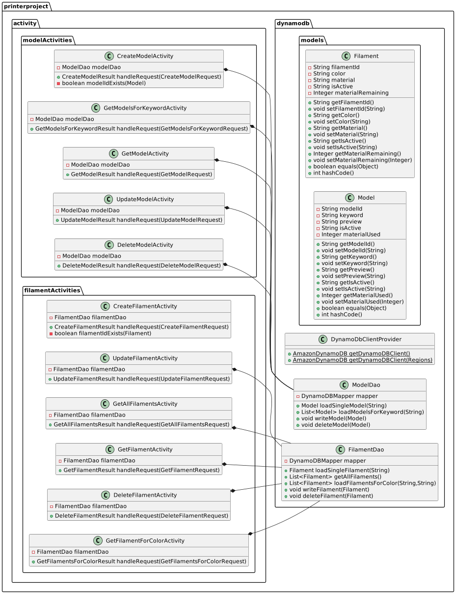
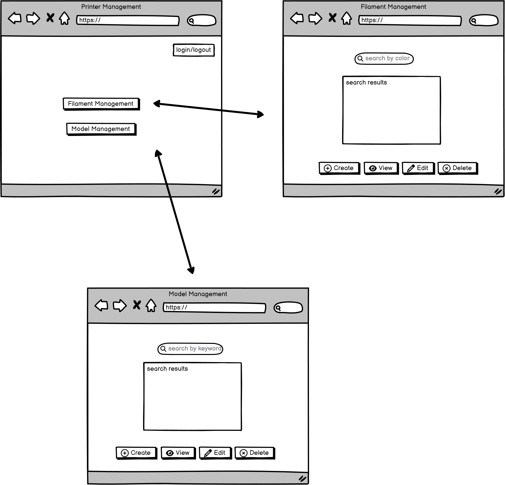

# printerproject

Project Printer Design Document

**1. Problem Statement**

Managing the inventory for filament and the 3d models to be printed in the 3d printer exhibit at the Adventure Science Center can be difficult with several different employees trying to keep track of them. There needs to be a central location for tracking these things that can be accessible by all employees from multiple devices.

This design document will outline an application for giving employees an interface for tracking inventory of filament stock and available 3d models, with the following features:

* Planned: A model management page with CRUD functionality for employees to view available 3d models and search by keywords
* Planned: A filament management page with CRUD functionality for employees to view available filaments and search by color
* Stretch: Implementation with printer control API to automatically send new print to the printer
* Stretch: Filament tracker in management page that keeps updated view of available filaments and remaining amount

**2. Top Questions to Resolve in Review**

* What is the best way to structure the model/filament tables with GSI to allow for effective inventory searching?
* What is the best way to visualize data for employee view?
* How can I structure the application to interact with the printer’s control software?

**3. Use Cases**

1. As an employee, I would like to be able to edit/add/remove models from the table and search by keywords
2. As an employee, I would like to be able to edit/add/remove filament from the table and search by color

**4. Project Scope**

**In scope**

* “Planned” features from above

**Out of scope**

* “Stretch” features from above

**5. Proposed Architecture Overview**

Backend will have tables stored in DynamoDB. Table access will be managed by individual DAOs, with each endpoint call handled by its own activity.

The frontend will consist of at least two separate pages: one for managing models and one for managing filaments. The pages will be built in HTML and Javascript, and the frontend will communicate with the backend through endpoints.

**6. API**

**6.1. Public Models**

<table>
  <tr>
   <td colspan="4" ><strong>Model POJO</strong>
   </td>
  </tr>
  <tr>
   <td><strong>Type</strong>
   </td>
   <td><strong>Name</strong>
   </td>
   <td><strong>Key</strong>
   </td>
   <td><strong>Expected Values</strong>
   </td>
  </tr>
  <tr>
   <td>String
   </td>
   <td>modelId
   </td>
   <td>Hash
   </td>
   <td>any
   </td>
  </tr>
  <tr>
   <td>String
   </td>
   <td>isActive
   </td>
   <td>GSI Range
   </td>
   <td>yes/no
   </td>
  </tr>
  <tr>
   <td>String
   </td>
   <td>keyword
   </td>
   <td>GSI Hash
   </td>
   <td>any
   </td>
  </tr>
  <tr>
   <td>String
   </td>
   <td>preview
   </td>
   <td>
   </td>
   <td>any
   </td>
  </tr>
  <tr>
   <td>Number
   </td>
   <td>materialUsed
   </td>
   <td>
   </td>
   <td>1-2000
   </td>
  </tr>
</table>

<table>
  <tr>
   <td colspan="4" ><strong>Filament POJO</strong>
   </td>
  </tr>
  <tr>
   <td><strong>Type</strong>
   </td>
   <td><strong>Name</strong>
   </td>
   <td><strong>Key</strong>
   </td>
   <td><strong>Expected Values</strong>
   </td>
  </tr>
  <tr>
   <td>String
   </td>
   <td>filamentId
   </td>
   <td>Hash
   </td>
   <td>any
   </td>
  </tr>
  <tr>
   <td>String
   </td>
   <td>isActive
   </td>
   <td>GSI Range
   </td>
   <td>True/False
   </td>
  </tr>
  <tr>
   <td>String
   </td>
   <td>color
   </td>
   <td>GSI Hash
   </td>
   <td>any
   </td>
  </tr>
  <tr>
   <td>String
   </td>
   <td>material
   </td>
   <td>
   </td>
   <td>any
   </td>
  </tr>
  <tr>
   <td>Number
   </td>
   <td>materialRemaining
   </td>
   <td>
   </td>
   <td>1-2000
   </td>
  </tr>
</table>

### **6.2. Endpoint List**

Model endpoint

* GET list of objects by modelId
* GET single object with modelId and keywords
* PUT single object
* DELETE single object
* POST single object

acti

Filament endpoint

* GET list of objects by filamentId
* GET single object with filamentId and keywords
* PUT single object
* DELETE single object
* POST single object

Vote endpoint

* GET single object with voteId
* GET all votes
* PUT single object
* DELETE single object
* POST single object

### **7. Tables**

<table>
  <tr>
   <td colspan="3" ><strong>Model Table</strong>
   </td>
  </tr>
  <tr>
   <td><strong>Name</strong>
   </td>
   <td><strong>Key</strong>
   </td>
   <td><strong>Attribute Type</strong>
   </td>
  </tr>
  <tr>
   <td>modelId
   </td>
   <td>Hash
   </td>
   <td>S
   </td>
  </tr>
  <tr>
   <td>isActive
   </td>
   <td>
   </td>
   <td>BOOL
   </td>
  </tr>
  <tr>
   <td>keywords
   </td>
   <td>
   </td>
   <td>S
   </td>
  </tr>
  <tr>
   <td>preview
   </td>
   <td>
   </td>
   <td>B
   </td>
  </tr>
  <tr>
   <td>materialUsed
   </td>
   <td>
   </td>
   <td>N
   </td>
  </tr>
</table>

<table>
  <tr>
   <td colspan="3" ><strong>Filament Table</strong>
   </td>
  </tr>
  <tr>
   <td><strong>Name</strong>
   </td>
   <td><strong>Key</strong>
   </td>
   <td><strong>Attribute Type</strong>
   </td>
  </tr>
  <tr>
   <td>filamentId
   </td>
   <td>Hash
   </td>
   <td>S
   </td>
  </tr>
  <tr>
   <td>isActive
   </td>
   <td>
   </td>
   <td>BOOL
   </td>
  </tr>
  <tr>
   <td>keywords
   </td>
   <td>
   </td>
   <td>S
   </td>
  </tr>
  <tr>
   <td>color
   </td>
   <td>
   </td>
   <td>S
   </td>
  </tr>
  <tr>
   <td>material
   </td>
   <td>
   </td>
   <td>S
   </td>
  </tr>
  <tr>
   <td>materialRemaining
   </td>
   <td>
   </td>
   <td>N
   </td>
  </tr>
</table>

### **8. Pages**

